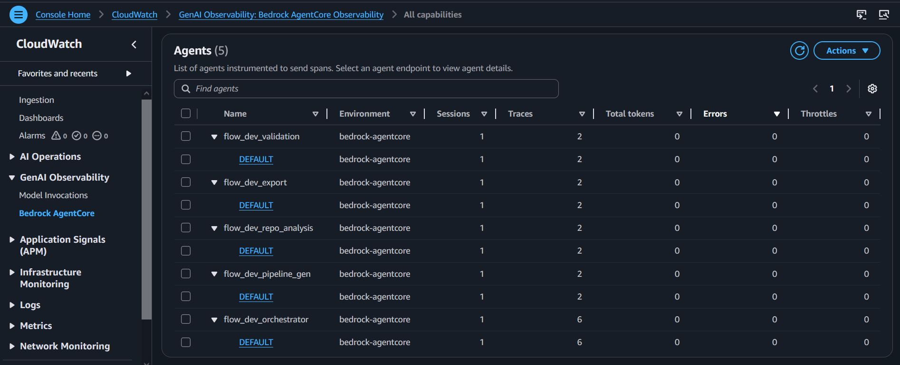

<div align="center">
  
  <h1>Flow</h1>
</div>

**A low-code tool for generating, running and exporting CI/CD pipelines — Bedrock agents, durable Lambda execution and ephemeral Lambda MicroVM runners.**

Users design pipelines on a visual canvas or describe them in natural language. A multi-agent backend on **Amazon Bedrock AgentCore** analyzes repositories, generates pipelines, validates them, and exports platform-specific config files. Pipelines can also be run directly inside Flow using isolated **Lambda MicroVM** runners.

## Architecture


### Frontend and APIs

| Component | Role |
|-----------|------|
| **AWS Amplify** | React + TypeScript UI — pipeline canvas (React Flow), agent chat, CI run panel, real-time progress |
| **HTTP API** | Pipeline and conversation CRUD + `POST /pipelines/{id}/run`; authorized via **Amazon Cognito** |
| **WebSocket API** | Real-time orchestrator chat and CI run progress (`connect`, `disconnect`, `default` Lambdas) |
| **DynamoDB** | Pipelines, conversations, WebSocket connections, CI run records |

### Orchestrator and agents

| Component | Role |
|-----------|------|
| **Orchestrator** | Central AgentCore Runtime — coordinates the workflow, invokes Bedrock models, streams progress |
| **AgentCore Memory** | Short-term session context + long-term semantic memory |
| **Repo Analysis** | Detects stack, structure, and existing CI config (uses MCP Gateway for GitHub) |
| **Pipeline Generation** | Builds structured pipeline JSON from analysis, including `runner_stages` and `repo_url` for CI execution |
| **Validation** | Scores pipeline quality and checks best practices |
| **Export** | Produces GitHub Actions, GitLab CI, Jenkins, CodePipeline, or Bitbucket config |

All agent runtimes run as containerized services on **AgentCore Runtime** (ECR + CodeBuild).

### CI Runner — Lambda MicroVMs

| Component | Role |
|-----------|------|
| **pipeline-run Lambda** | HTTP trigger (`POST /pipelines/{id}/run`) — generates a `run_id`, invokes the CI orchestrator |
| **CI Orchestrator Lambda** | Durable execution Lambda (`aws_durable_execution_sdk_python`) — launches one MicroVM per pipeline run, dispatches all stages, waits for completion |
| **Lambda MicroVM** | Ephemeral isolated runner booted from the `flow-ci-runner` image — clones the repo, executes all stages sequentially, streams logs to WebSocket |
| **CI Runs table** | DynamoDB table tracking run status (`running` / `completed` / `failed`) |
| **CI Artifacts bucket** | S3 bucket for inter-stage artifact transit (7-day TTL) |
| **MicroVM image** | AL2023 base + Python + Node.js + AWS CLI, built via `create_microvm_image` and managed by `terraform apply` |

**Run flow:**

```
POST /pipelines/{id}/run
  → pipeline-run Lambda  (returns run_id immediately)
  → CI Orchestrator (durable execution)
      → RunMicroVM  (one MicroVM for the full pipeline)
      → POST /run   (all stages dispatched at once)
      → MicroVM: clone repo → build → test → signal completion
      → pipeline_complete → WebSocket → canvas stage
```

### MCP Gateway and tools

| Component | Role |
|-----------|------|
| **AgentCore Gateway** | MCP endpoint for agent tool calls (`streamable-HTTP`) |
| **Cognito M2M** | OAuth 2.0 client credentials for agent → Gateway auth |
| **Cedar policy engine** | Allow/deny rules on Gateway tool invocations |
| **source-control Lambda** | `get_repo_info`, `get_file_tree`, `read_file_content`, `check_files_exist` → **GitHub API** |

### Observability and evaluation

| Component | Role |
|-----------|------|
| **AgentCore Observability** | ADOT/OpenTelemetry traces and vended logs → CloudWatch GenAI Observability |
| **AgentCore Evaluations** | Online LLM-as-a-Judge scoring on live orchestrator traffic |
| **MicroVM logs** | Runner logs streamed to `/aws/lambda-microvms/flow-ci-runner` in CloudWatch |

## Observability

All five agent runtimes and AgentCore Memory export **APPLICATION_LOGS** and **TRACES** to [CloudWatch GenAI Observability](https://docs.aws.amazon.com/AmazonCloudWatch/latest/monitoring/GenAI-observability.html). Agents run with ADOT (`opentelemetry-instrument`) and Strands OTLP telemetry so sessions, traces, FM token usage, and runtime metrics appear in the **Bedrock AgentCore** dashboard.

**Console:** CloudWatch → GenAI Observability → Bedrock AgentCore → Agents

After `terraform apply`:

```bash
cd infrastructure/terraform/environments/dev
terraform output genai_observability_console_url
terraform output observability_application_log_groups
```

### Agents

Per-runtime metrics. Agent names follow `{project}_{env}_{component}` with environment **bedrock-agentcore**.



| Agent | Role |
|-------|------|
| `flow_dev_orchestrator` | Coordinates workflow and WebSocket chat |
| `flow_dev_repo_analysis` | GitHub repo analysis via MCP Gateway |
| `flow_dev_pipeline_gen` | Pipeline JSON generation |
| `flow_dev_validation` | Pipeline quality scoring |
| `flow_dev_export` | CI/CD config export |

### CI run logs

Runner logs are grouped per run in CloudWatch:

```
/aws/lambda-microvms/flow-ci-runner
  └── runs/{run_id}/
```

```bash
aws logs tail /aws/lambda-microvms/flow-ci-runner --follow
```

## Repository layout

```
flow/
├── amplify/              # React frontend
├── agentcore/            # Agent runtimes, shared Gateway client, MCP tool Lambdas
├── lambda/               # API Gateway Lambdas (HTTP + WebSocket + CI runner)
│   ├── ci-runner/        # CI orchestrator handler and MicroVM runner application
│   └── pipelines/run/    # Pipeline-run trigger Lambda
├── infrastructure/       # Terraform (dev environment, modules)
├── evaluations/          # Online evaluation CLI (CreateOnlineEvaluationConfig)
├── scripts/              # Helper scripts (e.g. manage-online-eval)
└── docs/                 # Architecture diagrams and project docs
```

## Documentation

| Area | README |
|------|--------|
| Frontend | [amplify/README.md](amplify/README.md) |
| Agents + Gateway | [agentcore/README.md](agentcore/README.md) |
| Terraform / AWS | [infrastructure/terraform/README.md](infrastructure/terraform/README.md) |
| Online evaluation | [evaluations/README.md](evaluations/README.md) |

## Quick start

### Frontend

```bash
cd amplify
cp .env.example .env.local   # Cognito + API endpoints from terraform output
npm install
npm start
```

### Infrastructure

```bash
cd infrastructure/terraform/environments/dev
cp terraform.tfvars.example terraform.tfvars
terraform init
terraform apply
```

`terraform apply` also builds and registers the Lambda MicroVM runner image (waits until the image is `CREATED`).

Copy outputs (`http_api_endpoint`, `ws_api_endpoint`, `cognito_client_id`, etc.) into `amplify/.env.local`.

### Running a pipeline

1. Open the canvas and generate a pipeline using the agent chat (include your GitHub repo URL)
2. Click the **Run** button in the canvas toolbar
3. The CI run panel opens — stages turn green as they complete
4. View detailed logs: CloudWatch → `/aws/lambda-microvms/flow-ci-runner/runs/{run_id}/`

### Online evaluation (optional)

```bash
# Attach online_eval_developer_policy_arn to your IAM user first
./scripts/manage-online-eval.sh create
./scripts/manage-online-eval.sh status
```

## Export targets

| Platform | Output |
|----------|--------|
| GitHub Actions | `.github/workflows/ci.yml` |
| GitLab CI | `.gitlab-ci.yml` |
| AWS CodePipeline | `buildspec.yml` |
| Jenkins | `Jenkinsfile` |
| Bitbucket Pipelines | `bitbucket-pipelines.yml` |
