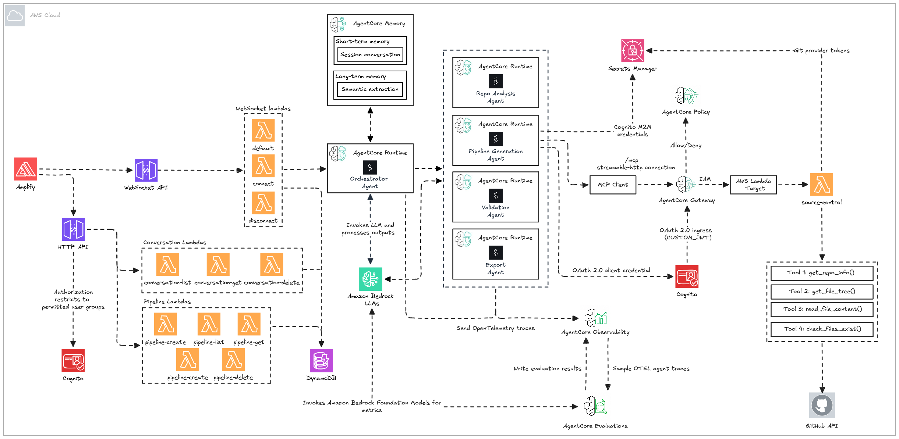

# Flow Platform

**A low-code tool for creating and configuring interactive CI/CD pipelines, with AI-assisted generation and export to GitHub Actions, GitLab CI, Jenkins, AWS CodePipeline, and Bitbucket Pipelines.**

Users design pipelines on a visual canvas or describe them in natural language. A multi-agent backend on **Amazon Bedrock AgentCore** analyzes repositories, generates pipelines, validates them, and exports platform-specific config files.

## Architecture



### Frontend and APIs

| Component | Role |
|-----------|------|
| **AWS Amplify** | React + TypeScript UI — pipeline canvas (React Flow), agent chat, real-time progress |
| **HTTP API** | Pipeline and conversation CRUD; authorized via **Amazon Cognito** |
| **WebSocket API** | Real-time orchestrator chat (`connect`, `disconnect`, `default` Lambdas) |
| **DynamoDB** | Pipelines, conversations, WebSocket connections |

### Orchestrator and agents

| Component | Role |
|-----------|------|
| **Orchestrator** | Central AgentCore Runtime — coordinates the workflow, invokes Bedrock models, streams progress |
| **AgentCore Memory** | Short-term session context + long-term semantic memory |
| **Repo Analysis** | Detects stack, structure, and existing CI config (uses MCP Gateway for GitHub) |
| **Pipeline Generation** | Builds structured pipeline JSON from analysis |
| **Validation** | Scores pipeline quality and checks best practices |
| **Export** | Produces GitHub Actions, GitLab CI, Jenkins, CodePipeline, or Bitbucket config |

All agent runtimes run as containerized services on **AgentCore Runtime** (ECR + CodeBuild).

### MCP Gateway and tools

| Component | Role |
|-----------|------|
| **AgentCore Gateway** | MCP endpoint for agent tool calls (`streamable-HTTP`) |
| **Cognito M2M** | OAuth 2.0 client credentials for agent → Gateway auth |
| **Cedar policy engine** | Allow/deny rules on Gateway tool invocations |
| **source-control Lambda** | `get_repo_info`, `get_file_tree`, `read_file_content`, `check_files_exist` → **GitHub API** |

### Observability and evaluation

| Component | Role |
|-----------|------|
| **AgentCore Observability** | ADOT/OpenTelemetry traces and vended logs → CloudWatch + X-Ray |
| **AgentCore Evaluations** | Online LLM-as-a-Judge scoring on live orchestrator traffic |

## Repository layout

```
flow/
├── amplify/              # React frontend
├── agentcore/            # Agent runtimes, shared Gateway client, MCP tool Lambdas
├── lambda/               # API Gateway Lambdas (HTTP + WebSocket)
├── infrastructure/       # Terraform (dev environment, modules)
├── evaluations/          # Online evaluation CLI (CreateOnlineEvaluationConfig)
├── scripts/              # Helper scripts (e.g. manage-online-eval)
└── docs/                 # Architecture diagrams and project docs
```

## Documentation

| Area | README |
|------|--------|
| Frontend | [amplify/README.md](amplify/README.md) |
| Agents + Gateway | [agentcore/README.md](agentcore/README.md) |
| Terraform / AWS | [infrastructure/terraform/README.md](infrastructure/terraform/README.md) |
| Online evaluation | [evaluations/README.md](evaluations/README.md) |

## Quick start

### Frontend

```bash
cd amplify
cp .env.example .env.local   # Cognito + API endpoints from terraform output
npm install
npm start
```

### Infrastructure

```bash
cd infrastructure/terraform/environments/dev
cp terraform.tfvars.example terraform.tfvars
terraform init
terraform apply
```

Copy outputs (`http_api_endpoint`, `ws_api_endpoint`, `cognito_client_id`, etc.) into `amplify/.env.local`.

### Online evaluation (optional)

```bash
# Attach online_eval_developer_policy_arn to your IAM user first
./scripts/manage-online-eval.sh create
./scripts/manage-online-eval.sh status
```

## Export targets

| Platform | Output |
|----------|--------|
| GitHub Actions | `.github/workflows/ci.yml` |
| GitLab CI | `.gitlab-ci.yml` |
| AWS CodePipeline | `buildspec.yml` |
| Jenkins | `Jenkinsfile` |
| Bitbucket Pipelines | `bitbucket-pipelines.yml` |
